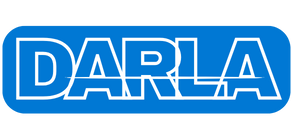

# Darla - Productivity Chrome Extension



## Overview

Darla is a Chrome extension designed to enhance productivity by facilitating forced logging of user activities. This extension aims to help users overcome procrastination by encouraging them to log their tasks and activities at regular intervals. With Darla, users can receive timely reminders, create logs, and maintain a record of their daily accomplishments.

## Features

- **Forced Logging:** Receive periodic notifications prompting you to log your current activity.
- **Customizable Reminders:** Tailor the frequency and timing of reminders to suit your workflow.
- **User-Controlled Blocking:** Enable or disable blocking of distracting websites based on your focus preferences.
- **User Privacy:** Respectful handling of user data and transparent logging practices.

## Installation

1. Clone this repository to your local machine.

   ```bash
   git clone https://github.com/your-username/darla-extension.git
   ```

2. Open Chrome and navigate to `chrome://extensions/`.

3. Enable "Developer mode" in the top right corner.

4. Click on "Load unpacked" and select the cloned repository folder.

5. Darla extension is now installed and ready to use!

## Usage

1. **Periodic Reminders:** Darla will notify you at regular intervals to log your current activity.

2. **Blocking Mode:** When activated, Darla can block distracting websites to help you maintain focus.

3. **Input Page:** Click on the notification to open an input page and provide details about your current task.

4. **User Control:** Use the extension icon in the Chrome toolbar to access settings and customize the extension's behavior.

## Contributing

We welcome contributions! If you'd like to contribute to Darla, please follow our [Contribution Guidelines](CONTRIBUTING.md).

## Issues and Feedback

If you encounter any issues or have feedback, please [open an issue](https://github.com/barathrum54/darla-extension/issues).

## License

This project is licensed under the [MIT License](LICENSE).
